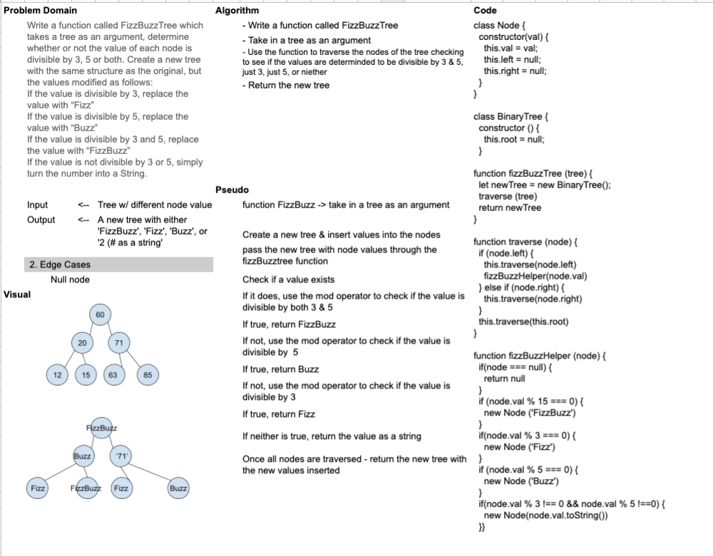

# Challenge Summary
<!-- Short summary or background information -->
FizzBuzz Tree

## Challenge Description
<!-- Description of the challenge -->
Write a function called FizzBuzzTree which takes a tree as an argument, determine whether or not the value of each node is divisible by 3, 5 or both. Create a new tree with the same structure as the original, but the values modified as follows:
- If the value is divisible by 3, replace the value with “Fizz”
- If the value is divisible by 5, replace the value with “Buzz”
- - If the value is divisible by 3 and 5, replace the value with “FizzBuzz”
If the value is not divisible by 3 or 5, simply turn the number into a String.

## Approach & Efficiency
<!-- What approach did you take? Why? What is the Big O space/time for this approach? -->
I took code from my original binary tree lab to form a tree constructor. I then wrote 3 functions to complete a total traversal & evaluation of the values. 

## Solution
<!-- Embedded whiteboard image -->
- [FizzBuzz Tree Code](fizz-buzz-tree.js)

